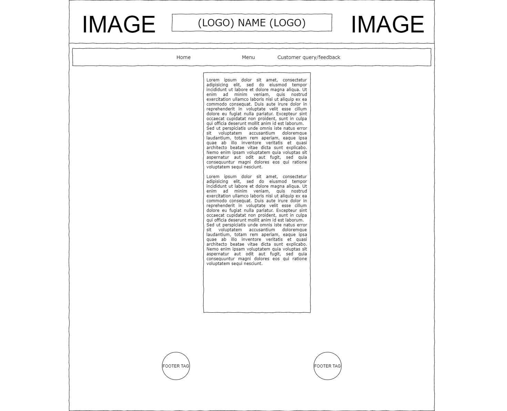
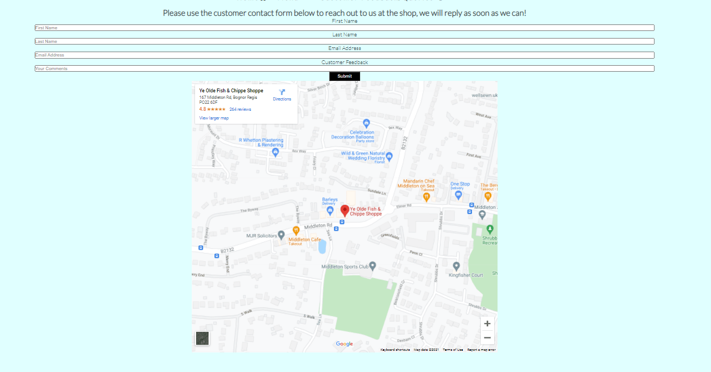
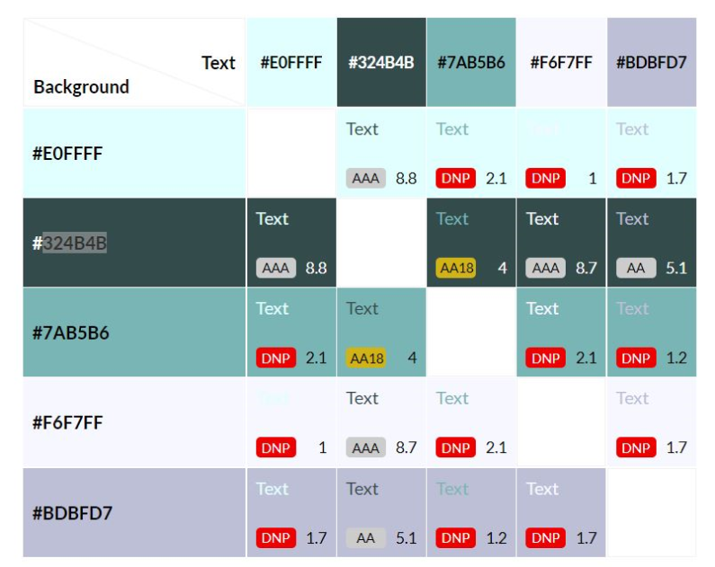

# Ye Olde Fish and Chippe Shoppe 

## Introduction 

Ye Olde Fish and Chippe Shoppe is a site all about the shop and what the business strives to aim to achieve for its customers. It aims for customers to be able to see what they're actually coming to when collecting their food with photos and also allows them to have a look at a menu before they arrive. 

### User Stories 

* As the organization we want to be able to provide customers with a site to be able to browse the food menu before their arrival. 

* As a user I want to easily find information about prices in the shop. 

* As the organization, we want to provide customers with a map to be able to find us. 

* As the organization we want to provide the customers with the ability to go from our site to other sites to do with us ie TripAdvisor and Facebook. 

## Wireframe mockups 

For my wireframes I used just normal pen and paper to sketch out the initial layout of the site as time went on the wireframes became outdated and I noticed unpractical and non-friendly themes for people with accessibility issues. Therefore I did make changes and carried this out on a separate program. 

I completed the overall structure of the site from the home page to the menu page etc. I then put this into practice and laid it out via gitpod and noticed there were also a few more issues such as text and color contrast issues. 

## Features 

### Common Features for sites 

* Navigation Bar 

* The navigation bar features a common design across all of the pages and is in keeping with the shop's logo and overall site's theme. 

* The navigation bar includes links on the logos on the left and right of the main header the navbar consists of a , Home, Menu, Queries/contact. The various title links head to the according-to website pages this allows the user to have easy navigation on the site. 

* The navigation bar is fully responsive, for smaller screens, the bar will become smaller text-wise and group on the left still being obvious as a navbar.   * A horizontal line appears under the page that is about to be selected done via the hover function I found that since the site only consisted of 3 pages it didn’t require an underline function to show which page was selected due to it saying below the nav bar on the page (Home, Menu, Queries). 

* Hero image 

* Each page includes a hero image with a text overlay to show that they are still on the same site and can navigate around and understand what page they are on within the site. 

* The image was carefully chosen via pixel as I wanted it to be light enough to ensure it draws the customer into the site. And to allow the text overlay with the title of the shop on there but not cause a contrast issue. 

* Footer  

* Each page includes a common footer that has just two buttons which allows them to access reviews of the shop from TripAdvisor a well-known review site within the food industry.   

* There is also a call to action for the user to then use the Facebook page and TripAdvisor to leave their reviews along with access to telephone numbers 

### Home Page Features 

* Home page 

* The home page includes a brief description and intro to the shop showing what the team believes in and what they want to achieve for customers along with the reassurance to customers of the hard work that everyone works for. 

* There are also a small inline-block element of photos showing the shop along with the food served to entice customers to come and buy from us.   

* Further down there is a call to action for customers with a contact number f they chose to visit us or to even place an order via the phone. 

* Also another inline-block element which consists of different fish for sale and what they are like as a product. 

### Menu Page Features 

* Menu page   

* The main section of the Menu page is just a menu set out to allow visitors to see a detailed menu with prices and also sizes. It offers to a wide range of customers from Adults, Children, and seniors. 

### Customer feedback/Queries page 

* The main section of this page is to allow the customer to reach out to us with any questions or issues they may face or be concerned about. A small dialogue above the contact form shows that there may be a small wait upon reply from filling the form out however will be answered as quickly as possible. 

* There is also a map to allow customers to locate us and find us which is embedded in the page via google maps. 

### Hidden Page 

* There is only one page that is hidden and not viewable. This page is the page that customers are greeted with when they fill out the contact form. This is important so customers know that they have submitted something to the site and that the “submit” button is actually doing something. 

## Future Enhancements 

In future enhancements I would like to try and combine an online ordering system, this, therefore, will mean customers can organize food without even leaving the house.  

I would also be interested in also adding a gallery page to allow customers to see all the food before committing to buy. 

## Testing 

I took a methodical and a two-stage process on development. I was continuously testing the site to ensure that there weren’t any obvious issues with the site and to ensure that all simple links directed me to the correct pages. When I started to style the site and to give it its own “theme” I came up with a light colour and then used a site called [EightShapes contrast grid](https://contrast-grid.eightshapes.com/) to ensure that all my contrasts are visible for all.
. I checked that when styling the site in the launch window that the styles were being applied accordingly.

I also used Wave report to ensure it was accessible and easily useable by all. As you can see no faults. It only flagged up two alerts. These alerts were due to "redundant links" the links in question are only to take the user back to the home page these links are the main header I therefore also don't believe this to be an issue. [Wave Report](https://wave.webaim.org/report#/https://olivertrain1221.github.io/Ye-olde-fish-and-chip-shop/)

Testing was performed with the following devices/browsers: 

* Google Chrome (laptop) 

* Microsoft Edge (laptop) 

* Safari (iPhone XR Max)

* Interesting Bugs 

*  One interesting issue I faced when coding the site was that there was an issue with the “sticky” element of my navbar. I found this fault in the early stages of development and found that it was because of a fault in my coding and this was due to me adding an extra “div” element in the site and was therefore only being the sticky bar within the element itself rather than it being an independent element and moving freely across the whole site. I addressed this issue and changed my code accordingly. 

* Another fault that I did find was the fact that when shrinking the size of the screen down the media query wasn’t applying the correct parameters to the “fish section” the inline box elements were aligning left. 

* My final fault was that even though my code worked and viewed correctly on a laptop down to 320px that when displayed on an iPhone XR Max on safari the customer feedback box was misaligned. I found this was due to me needing to run my CSS file through a autoprefixer in CSS.

After I ran it through a prefixer it ran correctly and worked accordingly.

## Validator Testing  

I used the W3C validator to ensure my code was correct and was replied only the one warning on various pages but are an acceptable "warning" to have.

* HTML  

* No errors were returned when passing through the official W3C Validator. 

* CSS 

* No errors were returned when passing through the official (Jigsaw) Validator  

* Lighthouse 

* I generated a lighthouse report for the deployed site through the Google Chrome Dev Tools. 

## Deployment

This project has been deployed to GitHub Pages.
From the repository, I went to the "Settings" tab and selected "Pages" from the sub-menu.
Once there, I selected the "main" branch from the dropdown, and then clicked the Save button.

The deployed site can be found [here](https://olivertrain1221.github.io/Ye-olde-fish-and-chip-shop).

### Local Deployment

If you would like to make a clone of this repository, you can type the following command in your terminal:

- `git clone https://github.com/Olivertrain1221/Ye-olde-fish-and-chip-shop.git`

Alternatively, if you are using Gitpod, you can simply click on the green Gitpod button at the top of the repository, and this will create a new workspace in your Gitpod account. [This link](https://gitpod.io/#https://github.com/Olivertrain1221/Ye-olde-fish-and-chip-shop) will do the same thing for you if you do not see the green Gitpod button. 

## Credits 

### Content   

* Ye Olde Fish and Chippe Owner -S. Poyser.
* Text and Images from owners current site.
* The reference material on HTML and CSS provided by w3schools.com was utilized to implement and help with understanding regarding flexbox and grid and as general reference material for other areas.
* Icons used for the various links on the site were taken from Font Awesome

### Media  

* The image used for hero image on the main banner on each page was provided royalty-free through pexels.com.
* The Favicon, links, and meta code were generated by Realfavicongenerator.net
* The Images of the shop were taken from the owner's current site.

